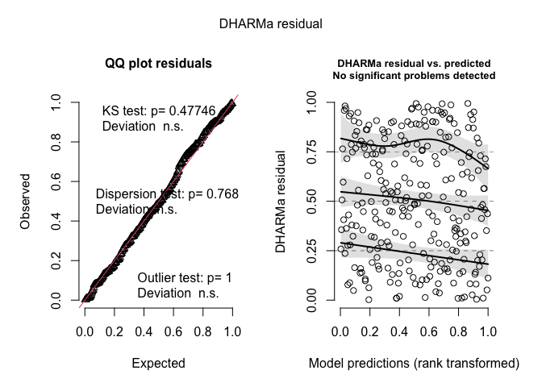
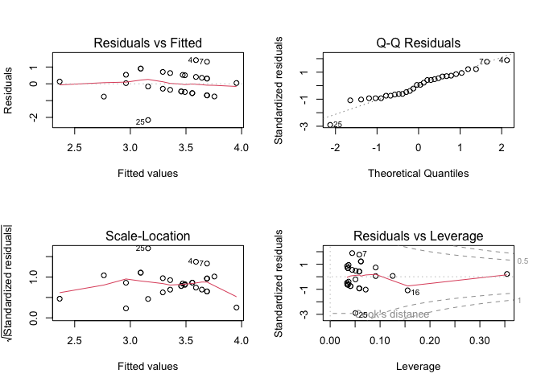
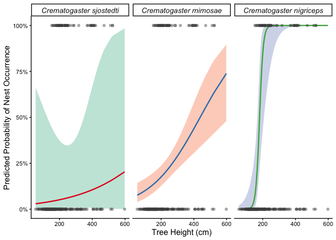
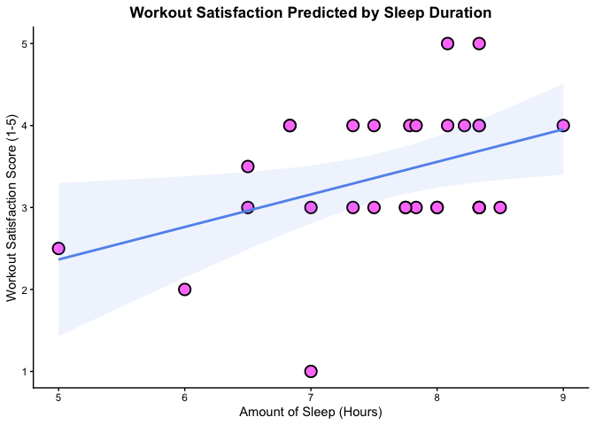

# ENVS-193DS_spring-2026_final

Repo for final for ENVS193DS spring quarter!

## General information

This repo provides answers for the final problems, of which have to do with 
research writing, data analysis, and affective and exploratory visualizations. 

This is a repo made just for the final.  

## Data and file information

There is a `data` folder in which data files are stored.

There is a `code` folder in which all code is stored. 

## Rendered output

The rendered pdf for the DHARMa residuals is 

The rendered pdf for the residuals plots is 

The rendered pdf for the interactive logistic model is 

The rendered pdf for the linear regression model is 